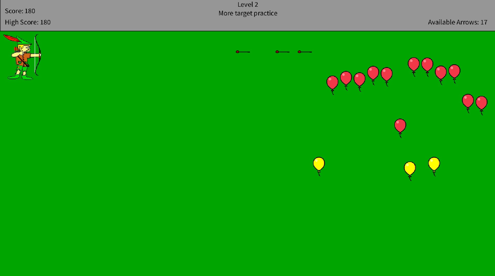
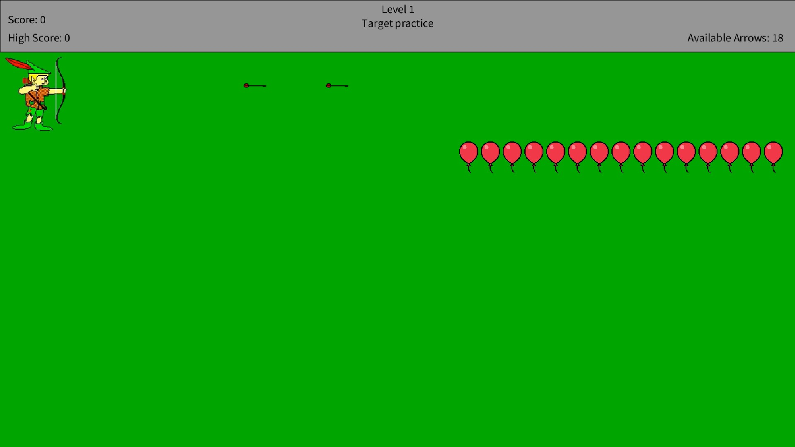
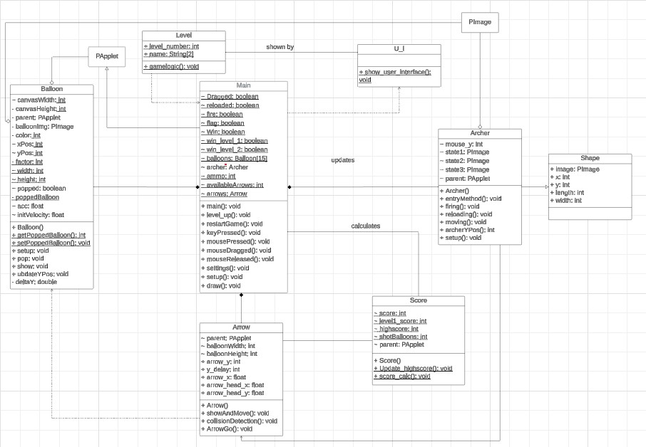

# Bow and Arrow game

Welcome to Bow and Arrow challenge - A simple game using Processing and Java.

- An exciting game that tests your precision, speed, and strategic thinking!
- The game should simulate the mechanics of shooting a bow
and arrow, challenging players with precision and accuracy.
- The README.md of this game as a [website](https://engmazenatlam.github.io/Bow-and-Arrow/)

## Agenda

- [`Game controls`](#game-controls)
- [`Levels`](#game-levels)
- [`Balloon Dynamics`](#balloon-dynamics)
- [`Scoring`](#scoring-system)
- [`Game Strstegy`](#game-strategy)
- [`UML class diagram`](#uml-class-diagram)
- [`The Team`](#the-team)

## Game Controls

The game uses the mouse only to do actions:

|**Control key**|**Action**|
|:----|:----|
|Mouse left click and drag|Control the vertical placement of the archer|
|Right click|Reload your arrow|
|Left click|Fire the arrow|

## Game Levels

You start each level with a quiver of 20 arrows.

1. **Level One:**
    - 15 red balloons aligned next to each other.
    - Pop each balloon to progress to the next level.

2. **Level Two:**
    - 15 random balloons, 3 tricky yellow balloons and 12 red balloons.
    - The yellow balloons have irregular speed and acceleration,
        providing an additional challenge.
    - Balloons are randomly placed, adding an element of surprise.

- You start each level with a quiver of 20 arrows.

## Balloon Dynamics

1. **Red Balloons:**
    - Constant speed and zero acceleration.

2. **Yellow Balloons:**
    - Irregular speed and acceleration for an extra challenge.

## Scoring System

- Score = (Remaining Arrows + 1) * Number of Shot Balloons.
- The score accumulates each turn, reflecting your skill and accuracy.
- Progress to the next level upon successfully hitting all the balloons
    in the current level.

## Game Strategy

- Plan your shots carefully to maximize your score.
- Watch out for the unpredictable yellow balloons in Level Two.
- Aim for efficiency and accuracy to conquer each level.

## UML class diagram

## The Team

**Name:** Elgamma

**Members and their roles:**

1. Mazen Atef Awad Atlam
    - Project management
    - Create README.md page
    - Documentation (class diagram, GitHub Issues)
    - Demonstration
    - Help other members in coding
2. Sherif Mohamed Mahmoud Elgendy
    - Create Archer class
    - Create Shape class
    - Merging classes
3. Anas Mohamed Abdelaziz Elsheikh
    - Create Arrows class
    - Create Score class
    - Merging classes
4. Ahmed Abdelghaffar Mostafa Shehab
    - Create Level class
    - Create Main class
    - Create U_I class
5. Mohamed Ahmed Mahmoud Gad
    - Create Balloon class
    - Documentation (Include a brief documentation file)
    - Merging classes
    - Help other members in coding

**
Have Fun and Aim True!
**

